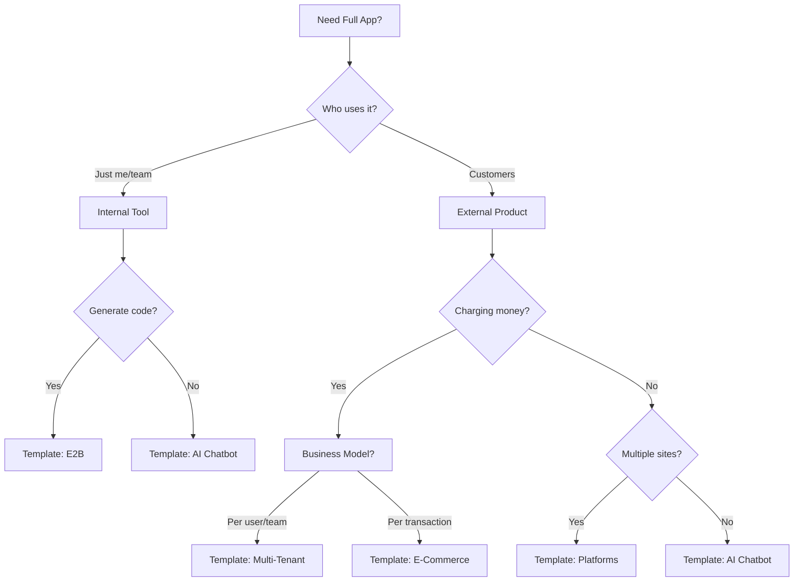

# Pattern 05: Full Application

## When You've Outgrown Patterns 1-4

You need Pattern 05 when:
- ✅ Your tool is used by multiple people (not just you)
- ✅ You need a web interface (not just CLI)
- ✅ You need user authentication and data persistence
- ✅ You're charging money for it
- ✅ You need real-time updates or collaboration

## The 3-Layer Architecture

```
┌─────────────────────────────────────────┐
│  LAYER 1: FACE (UI)                     │
│  - Next.js App Router                   │
│  - Tailwind CSS + shadcn/ui            │
│  - Real-time streaming UI               │
└─────────────────────────────────────────┘
                 ↕
┌─────────────────────────────────────────┐
│  LAYER 2: HEAD (AI Orchestration)       │
│  - Vercel AI SDK                        │
│  - Tool routing & management            │
│  - Streaming responses                  │
└─────────────────────────────────────────┘
                 ↕
┌─────────────────────────────────────────┐
│  LAYER 3: DNA (Data & Services)         │
│  - Supabase (PostgreSQL + Auth)         │
│  - Upstash (Redis + Vector DB)          │
│  - External APIs (Stripe, etc.)         │
└─────────────────────────────────────────┘
```

## Quick Start Templates

We've identified the **5 essential templates** that cover 90% of use cases:

### 1. 🏆 AI Chatbot (Default Choice)
**Template:** `nextjs-ai-chatbot`
```bash
npx create-next-app@latest my-app --example https://github.com/vercel/ai-chatbot
```

**Best for:**
- Customer support bots
- Documentation assistants
- Internal knowledge bases
- Q&A systems

**Includes:**
- Vercel AI SDK
- Streaming chat UI
- Message history
- Auth (NextAuth)
- PostgreSQL (Vercel Postgres)

### 2. 🚀 Code Generation Platform
**Template:** `e2b-code-interpreter`
```bash
git clone https://github.com/e2b-dev/ai-artifacts-for-next.git my-app
```

**Best for:**
- Code generation tools
- Data analysis platforms
- Educational coding environments
- Technical automation

**Includes:**
- E2B sandboxes for safe code execution
- Multi-file code editor
- Real-time preview
- Version control

### 3. 💼 Multi-Tenant SaaS
**Template:** `multi-tenant-saas`
```bash
git clone https://github.com/clerkinc/multi-tenant-nextjs my-app
```

**Best for:**
- B2B SaaS applications
- Team collaboration tools
- Enterprise software
- Workspace-based apps

**Includes:**
- Clerk authentication
- Team management
- Role-based access
- Billing per tenant
- Invitation system

### 4. 🛍️ E-Commerce + AI
**Template:** `commerce-with-ai`
```bash
npx create-next-app@latest my-app --example https://github.com/vercel/commerce
# Then add AI features
```

**Best for:**
- Online stores with AI recommendations
- Subscription services
- Digital product sales
- Marketplace platforms

**Includes:**
- Stripe integration
- Product catalog
- Shopping cart
- AI-powered search
- Recommendation engine

### 5. 🌐 Multi-Site Platform
**Template:** `platforms-starter`
```bash
git clone https://github.com/vercel/platforms my-app
```

**Best for:**
- Website builders
- Blog platforms
- Documentation sites
- White-label solutions

**Includes:**
- Multi-tenancy
- Custom domains
- MDX content
- Theme system
- Analytics per site

## Choosing the Right Template



## Setting Up Your Chosen Template

### Step 1: Clone and Install
```bash
# Pick your template from above
git clone [template-url] my-agent-app
cd my-agent-app
npm install
```

### Step 2: Configure Environment
```bash
cp .env.example .env.local
```

Edit `.env.local` with your keys:
```env
# AI Provider
OPENAI_API_KEY=sk-...
# or
ANTHROPIC_API_KEY=sk-ant-...

# Database (Supabase)
NEXT_PUBLIC_SUPABASE_URL=https://xxx.supabase.co
NEXT_PUBLIC_SUPABASE_ANON_KEY=eyJ...
SUPABASE_SERVICE_ROLE_KEY=eyJ...

# Auth (Clerk or NextAuth)
NEXT_PUBLIC_CLERK_PUBLISHABLE_KEY=pk_...
CLERK_SECRET_KEY=sk_...

# Payments (Stripe)
STRIPE_SECRET_KEY=sk_...
STRIPE_WEBHOOK_SECRET=whsec_...
```

### Step 3: Set Up Database
```bash
# With Supabase
npx supabase init
npx supabase db push

# With Prisma
npx prisma db push
npx prisma generate
```

### Step 4: Run Development Server
```bash
npm run dev
# Open http://localhost:3000
```

### Step 5: Deploy
```bash
# Deploy to Vercel (recommended)
npm install -g vercel
vercel

# Or deploy to Railway/Render/AWS
```

## Integrating Your Previous Patterns

### Using Pattern 2 Scripts
```typescript
// app/api/automation/route.ts
import { loadTemplate, getModel } from '../../../02-reusable/run';

export async function POST(req: Request) {
  const { variables } = await req.json();
  const prompt = loadTemplate('./prompts/template.md', variables);
  const result = await generateText({
    model: getModel('openai', 'gpt-4'),
    prompt,
  });
  return Response.json({ result: result.text });
}
```

### Using Pattern 3 Sub-Agents
```typescript
// app/api/orchestrate/route.ts
import { runOrchestrator } from '../../../03-sub-agents/orchestrator';

export async function POST(req: Request) {
  const { goal } = await req.json();
  const result = await runOrchestrator(goal);
  return Response.json({ result });
}
```

### Connecting Pattern 4 MCP Tools
```typescript
// lib/tools.ts
import { tool } from 'ai';

// Import your MCP tool handlers
import {
  executeDatabaseQuery,
  executeSendEmail,
  executeWebScraper,
} from '../04-mcp-wrapper/implementations';

// Wrap them for Vercel AI SDK
export const tools = {
  queryDatabase: tool({
    description: 'Query the database',
    parameters: z.object({
      query: z.string(),
    }),
    execute: async ({ query }) => executeDatabaseQuery(query, 'main'),
  }),
  // ... more tools
};
```

## Common Customizations

### Add Real-Time Features
```typescript
// Using Vercel AI SDK streaming
import { streamText } from 'ai';
import { createStreamableValue } from 'ai/rsc';

export async function generateResponse(prompt: string) {
  const stream = createStreamableValue('');

  (async () => {
    const { textStream } = await streamText({
      model: openai('gpt-4'),
      prompt,
    });

    for await (const text of textStream) {
      stream.update(text);
    }
    stream.done();
  })();

  return stream.value;
}
```

### Add Vector Search
```typescript
// Using Upstash Vector
import { Index } from '@upstash/vector';

const index = new Index({
  url: process.env.UPSTASH_VECTOR_URL!,
  token: process.env.UPSTASH_VECTOR_TOKEN!,
});

// Store embeddings
await index.upsert({
  id: 'doc-1',
  vector: embedding,
  metadata: { content: 'original text' },
});

// Search
const results = await index.query({
  vector: queryEmbedding,
  topK: 5,
});
```

### Add Background Jobs
```typescript
// Using Upstash QStash
import { Client } from '@upstash/qstash';

const qstash = new Client({
  token: process.env.QSTASH_TOKEN!,
});

// Schedule a job
await qstash.publishJSON({
  url: 'https://my-app.com/api/jobs/process',
  body: { taskId: '123' },
  delay: 60, // Run after 60 seconds
});
```

## Production Checklist

Before going live:

### Security
- [ ] Environment variables secured
- [ ] API routes protected with authentication
- [ ] Rate limiting implemented
- [ ] Input validation on all endpoints
- [ ] CORS configured properly

### Performance
- [ ] Database queries optimized
- [ ] Caching strategy implemented
- [ ] Image optimization enabled
- [ ] API responses paginated
- [ ] Streaming for long operations

### Monitoring
- [ ] Error tracking (Sentry)
- [ ] Analytics (Vercel Analytics)
- [ ] Logging (Axiom/Logtail)
- [ ] Uptime monitoring
- [ ] Cost tracking for AI usage

### Scaling
- [ ] Database connection pooling
- [ ] Redis for session storage
- [ ] CDN for static assets
- [ ] Queue for background jobs
- [ ] Webhook processing async

## Resources

### Official Starters
- [Vercel AI Templates](https://vercel.com/templates/ai)
- [Next.js Examples](https://github.com/vercel/next.js/tree/canary/examples)
- [Supabase Examples](https://github.com/supabase/supabase/tree/master/examples)

### Documentation
- [Vercel AI SDK Docs](https://sdk.vercel.ai/docs)
- [Next.js Docs](https://nextjs.org/docs)
- [Supabase Docs](https://supabase.com/docs)
- [Upstash Docs](https://docs.upstash.com)

### Communities
- [Vercel Discord](https://vercel.com/discord)
- [Next.js Discord](https://nextjs.org/discord)
- [AI SDK GitHub Discussions](https://github.com/vercel/ai/discussions)

---

## Remember: You Don't Always Need Pattern 05!

Before building a full app, ask yourself:
- Can Pattern 2 (script) solve this? → 1 day of work
- Can Pattern 3 (sub-agents) handle the complexity? → 3 days of work
- Can Pattern 4 (MCP) provide the integrations? → 1 week of work
- Do I really need Pattern 5 (full app)? → 1+ month of work

**Start simple, evolve when necessary.**