# 🏭 Agent Factory - The 5-Pattern AI Agent Starter Kit

**Stop starting from scratch. Pick a pattern, fill in the blanks, ship it.**

This repository implements the **5 Core Agent Patterns** - a pragmatic framework for building AI agents that scales with your needs. Start simple with Pattern 1, evolve to Pattern 5 only when necessary.

## 🎯 The Philosophy: Keep It Simple, Scale When Needed

Most AI projects fail because they start too complex. This framework enforces the opposite:
1. **Start with the simplest pattern that works**
2. **Only evolve when you hit real limitations**
3. **Each pattern builds on the previous one**
4. **No premature optimization**

## 📊 The Decision Tree

```mermaid
graph TD
    Start[New AI Task] --> FirstTime{Used Before?}

    FirstTime -->|Never| Pattern1[Pattern 01: Ad Hoc]
    FirstTime -->|Yes| Frequency{How Often?}

    Frequency -->|< 3 times| Pattern1
    Frequency -->|3+ times| Pattern2[Pattern 02: Reusable]

    Pattern1 --> Repeat{Need Again?}
    Repeat -->|No| Done1[✅ Done]
    Repeat -->|Yes| Pattern2

    Pattern2 --> Complex{Too Complex?}
    Complex -->|No| Done2[✅ Done]
    Complex -->|Yes| Pattern3[Pattern 03: Sub-Agents]

    Pattern3 --> Services{3+ Services?}
    Services -->|No| Done3[✅ Done]
    Services -->|Yes| Pattern4[Pattern 04: MCP Wrapper]

    Pattern4 --> Users{Multiple Users?}
    Users -->|No| Done4[✅ Done]
    Users -->|Yes| Pattern5[Pattern 05: Full App]

    Pattern5 --> Done5[✅ Productized]

    style Pattern1 fill:#e1f5fe
    style Pattern2 fill:#b3e5fc
    style Pattern3 fill:#4fc3f7
    style Pattern4 fill:#29b6f6
    style Pattern5 fill:#039be5
```



## 🚀 Quick Start

```bash
# 1. Clone this repository
git clone https://github.com/yourusername/agent-factory.git
cd agent-factory

# 2. Install dependencies
npm install

# 3. Set up environment
cp .env.example .env
# Edit .env with your API keys

# 4. Pick your pattern and start building!
```

## 📁 Repository Structure

```
agent-factory/
├── 01-ad-hoc/           # Pattern 1: Manual discovery
├── 02-reusable/         # Pattern 2: Automation scripts
├── 03-sub-agents/       # Pattern 3: Multi-agent orchestration
├── 04-mcp-wrapper/      # Pattern 4: Tool integration server
├── 05-full-app/         # Pattern 5: Full application templates
├── package.json         # Shared dependencies
├── .env.example         # Environment template
└── README.md           # You are here
```

## 🎨 The 5 Patterns Explained

### Pattern 01: Ad Hoc Prompts 🔬
**When:** First time solving a problem
**Time:** Minutes
**Tool:** Markdown notes

```bash
# Just take notes and experiment
cat 01-ad-hoc/discovery-log.md
```

**Example Use Cases:**
- Testing a new AI capability
- Exploring data extraction methods
- Prototyping conversation flows
- One-off data analysis

### Pattern 02: Reusable Prompt ♻️
**When:** Same task 3+ times
**Time:** Hours
**Tool:** TypeScript automation script

```bash
# Edit variables in run.ts, then:
npm run pattern2
```

**Example Use Cases:**
- Daily report generation
- Regular data processing
- Content creation workflows
- Code review automation

### Pattern 03: Sub-Agent Pattern 🤝
**When:** Task needs specialization
**Time:** Days
**Tool:** Multi-agent orchestrator

```bash
# Configure your goal in orchestrator.ts, then:
npm run pattern3
```

**Example Use Cases:**
- Research + Analysis + Writing pipeline
- Complex decision trees
- Multi-step validation processes
- Parallel task execution

### Pattern 04: MCP Wrapper 🔌
**When:** Integrating 3+ external services
**Time:** Week
**Tool:** MCP server for Claude Desktop

```bash
# Start the MCP server:
npm run pattern4
# Then connect via Claude Desktop
```

**Example Use Cases:**
- Database + Email + API integrations
- Cross-platform tool access
- Shared tool libraries
- Service orchestration

### Pattern 05: Full Application 🚢
**When:** Building for end users
**Time:** Month+
**Tool:** Next.js + Vercel AI SDK

```bash
# Choose a template:
cd 05-full-app
# Follow the README for your chosen template
```

**Example Use Cases:**
- SaaS products
- Customer-facing chatbots
- Internal tools with UI
- Monetized services

## 🛠️ Pattern Evolution Examples

### Example 1: Customer Support Bot
```
Day 1 → Pattern 01: Test with 10 support tickets manually
Day 3 → Pattern 02: Script to categorize tickets automatically
Week 2 → Pattern 03: Add sentiment analysis and priority routing
Month 1 → Pattern 04: Integrate with Zendesk, Slack, and email
Month 2 → Pattern 05: Build web interface for support team
```

### Example 2: Code Review Assistant
```
Hour 1 → Pattern 01: Manually test prompts for code review
Day 1 → Pattern 02: Script to review Git commits
Week 1 → Pattern 03: Separate agents for security, performance, style
Week 2 → Pattern 04: Connect to GitHub, GitLab, Bitbucket
Month 1 → Pattern 05: VS Code extension or web app
```

### Example 3: Data Analysis Pipeline
```
Hour 1 → Pattern 01: Explore data with ChatGPT
Day 1 → Pattern 02: Automated daily analysis script
Week 1 → Pattern 03: Specialized agents for different metrics
Month 1 → Pattern 04: Connect to databases, APIs, warehouses
Quarter 1 → Pattern 05: Full analytics dashboard
```

## 📋 Available Scripts

```bash
# Pattern 2: Run reusable prompt
npm run pattern2

# Pattern 3: Run orchestrator
npm run pattern3

# Pattern 4: Start MCP server
npm run pattern4

# Development mode (with hot reload)
npm run dev:pattern2
npm run dev:pattern3
npm run dev:pattern4

# Type checking
npm run type-check
```

## 🔧 Configuration

### Environment Variables
Create `.env` file:

```env
# AI Providers (choose one or both)
OPENAI_API_KEY=sk-...
ANTHROPIC_API_KEY=sk-ant-...

# Optional: Override default models
AI_PROVIDER=openai # or anthropic
AI_MODEL=gpt-4o # or claude-3-5-sonnet-20241022
ORCHESTRATOR_MODEL=gpt-4o
SUB_AGENT_MODEL=gpt-4o-mini

# Pattern 4: MCP Server
DATABASE_URL=postgresql://...
REDIS_URL=redis://...
RESEND_API_KEY=re_...

# Pattern 5: Full App
NEXT_PUBLIC_SUPABASE_URL=...
SUPABASE_SERVICE_ROLE_KEY=...
STRIPE_SECRET_KEY=...
```

### Claude Desktop Setup (Pattern 4)
Add to `~/Library/Application Support/Claude/claude_desktop_config.json`:

```json
{
  "mcpServers": {
    "agent-factory": {
      "command": "node",
      "args": ["/absolute/path/to/agent-factory/04-mcp-wrapper/server.js"]
    }
  }
}
```

## 📚 Learning Path

### Week 1: Master the Basics
- [ ] Read all pattern READMEs
- [ ] Complete Pattern 01 discovery for your use case
- [ ] Build your first Pattern 02 automation
- [ ] Understand when to evolve patterns

### Week 2: Multi-Agent Systems
- [ ] Build a Pattern 03 orchestrator
- [ ] Create 3 specialized sub-agents
- [ ] Chain agents together
- [ ] Add error handling

### Week 3: Integrations
- [ ] Set up Pattern 04 MCP server
- [ ] Add 3 external service integrations
- [ ] Connect to Claude Desktop
- [ ] Build a tool library

### Month 2: Production
- [ ] Choose a Pattern 05 template
- [ ] Deploy to Vercel
- [ ] Add authentication
- [ ] Implement billing

## 🤔 Common Questions

### "Should I start with Pattern 5?"
**No!** Start with Pattern 1. You might discover that Pattern 2 solves your problem completely. Every pattern you skip is complexity you avoid.

### "When do I evolve patterns?"
When you feel real pain, not imagined future pain:
- Pattern 1→2: "I'm copy-pasting this prompt again..."
- Pattern 2→3: "This prompt is 500 lines long..."
- Pattern 3→4: "I need to check 5 different services..."
- Pattern 4→5: "My boss wants a web interface..."

### "Can I skip patterns?"
Yes, but you're probably over-engineering. The patterns exist to prevent premature optimization.

### "What if I need Pattern 5 features in Pattern 2?"
You don't. You think you do, but you don't. Ship Pattern 2, get feedback, then decide.

### "Which AI model should I use?"
- **GPT-4o**: Best for complex reasoning (Pattern 3-5)
- **GPT-4o-mini**: Great for simple tasks (Pattern 1-2)
- **Claude 3.5 Sonnet**: Best for code generation
- **Claude 3.5 Haiku**: Fast and cheap for high volume

## 🎯 The Golden Rules

1. **Start stupidly simple** - Pattern 1 always
2. **Feel the pain first** - Don't solve problems you don't have
3. **Automate the repetitive** - 3 times = Pattern 2
4. **Delegate to specialists** - Complex = Pattern 3
5. **Integrate when necessary** - 3+ services = Pattern 4
6. **Build products last** - UI = Pattern 5

## 📖 Resources

### Documentation
- [Vercel AI SDK](https://sdk.vercel.ai/docs)
- [Model Context Protocol](https://modelcontextprotocol.io)
- [OpenAI API](https://platform.openai.com/docs)
- [Anthropic API](https://docs.anthropic.com)

### Templates & Examples
- [Vercel AI Templates](https://vercel.com/templates/ai)
- [E2B Code Execution](https://e2b.dev)
- [Supabase Examples](https://supabase.com/docs/guides/examples)

### Community
- [GitHub Discussions](https://github.com/yourusername/agent-factory/discussions)
- [Discord Server](https://discord.gg/agent-factory)

## 🤝 Contributing

We welcome contributions! Please:
1. Start with Pattern 01 for new ideas
2. Document your pattern evolution
3. Share what worked and what didn't
4. Keep it simple

## 📄 License

MIT License - Use this however you want!

---

## 🚀 Ready to Build?

1. **Pick your current pain point**
2. **Start with the simplest pattern**
3. **Evolve only when necessary**
4. **Ship something today**

Remember: **The best agent is the one that ships.**

---

*Built with the philosophy: "Premature optimization is the root of all evil" - Donald Knuth*

**Stop planning. Start shipping. Evolve naturally.**